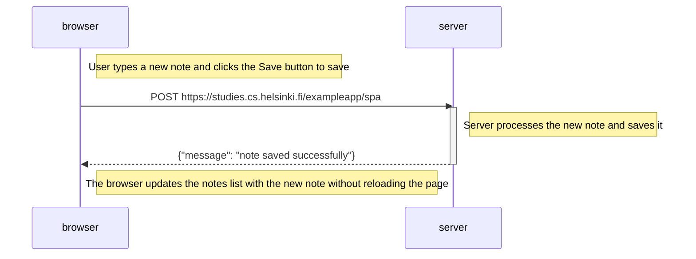

```mermaid
sequenceDiagram
    participant browser
    participant server

    Note right of browser: User types a new note and clicks the Save button to save

    browser->>server: POST https://studies.cs.helsinki.fi/exampleapp/spa
    activate server
    Note right of server: Server processes the new note and saves it
    server-->>browser: {"message": "note saved successfully"}
    deactivate server

    Note right of browser: The browser updates the notes list with the new note without reloading the page
```
